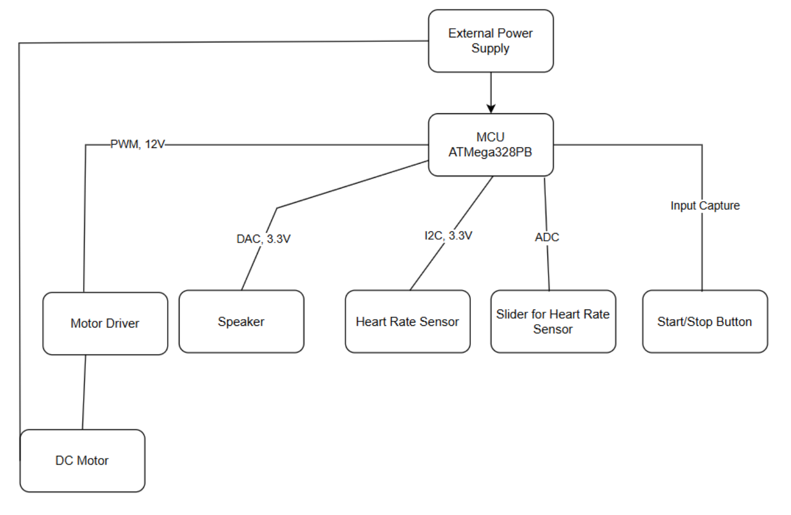
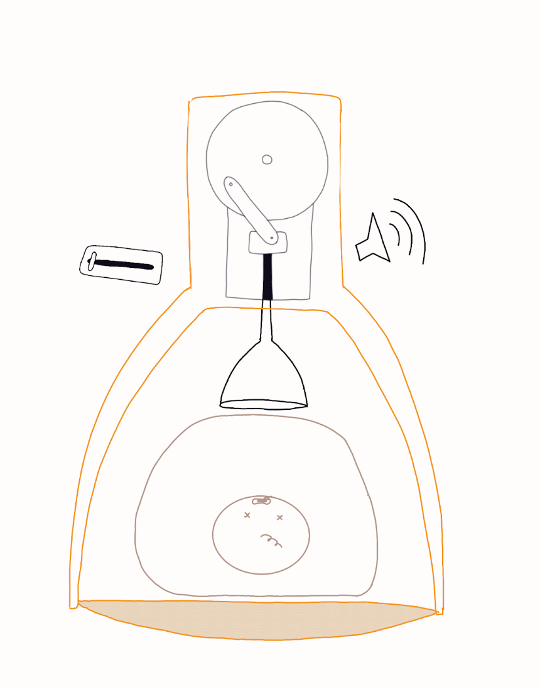
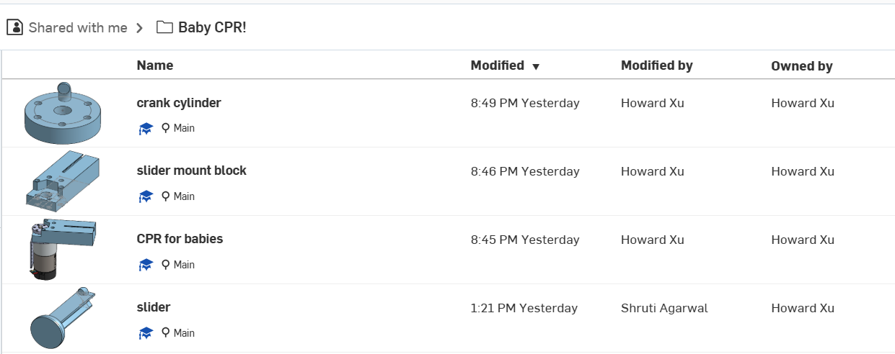

# final-project-skeleton

* Team Number: 8
* Team Name: Stayin Alive
* Team Members: Shruthi A, Howard X, Zora M
* GitHub Repository URL: https://github.com/upenn-embedded/final-project-s25-stayin-aliveThis project is a baby CPR machine that uses a crank-slider mechanism powered by a motor to perform real chest compressions, while a speaker relays real-time voice instructions and audio cues. The system also includes a heart rate sensor to determine the effectiveness of CPR and a user-controlled knob to adjust compression speed through an analog input. This device is designed to be a fully functional CPR machine for emergency infant care scenarios.
* GitHub Pages Website URL: [for final submission]

## Final Project Proposal

### 1. Abstract

This project is a baby CPR machine that uses a crank-slider mechanism powered by a motor to perform real chest compressions, while a speaker relays real-time voice instructions and audio cues. The system also includes a heart rate sensor to determine the effectiveness of CPR and a user-controlled knob to adjust compression speed through an analog input. This device is designed to be a fully functional CPR machine for emergency infant care scenarios.

### 2. Motivation

Sudden cardiac arrest in infants requires immediate and precise CPR. Manual CPR can be inconsistent and tiring, especially for untrained or stressed individuals. This device aims to provide an automated CPR solution for infants that ensures precise compression timing and force, giving caregivers and responders a reliable way to administer emergency resuscitation. It also provides audio feedback and celebrates success by playing a tune when a viable heartbeat is detected. There is significant unmet need in this product space, as existing devices only work on adults and have an exorbitant price range.

### 3. System Block Diagram

### 4. Design Sketches

##### Component Parts:

* Base will house motor and crank-slider mechanism
* Soft padded “suction cup” compressor on infant’s chest
* Embedded speaker for instructional audio and success signal
* External slider to control compression speed (via ADC)
* Heart rate sensor placed on dummy or user to detect pulse

Manufacturing Techniques: 3D printing (housing, crank slider mechanism part)

### 5. Software Requirements Specification (SRS)

**5.2 Functionality**

| ID    | Description                                                                                                                                  |
| ----- | -------------------------------------------------------------------------------------------------------------------------------------------- |
| SRS-1 | Timing 100-120 compressions per minute via PWM.                                                                                              |
| SRS-2 | Input capture to time when to stop compressions (and begin simulator “breaths”?). Should be around 15 seconds in the compression sequence. |
| SRS-3 | ADC from input slider pin to modulate compression frequency.                                                                                 |
| SRS-4 | Voice instructions synchronization with motor operations.                                                                                    |
| SRS-5 | Start/stop button pin change interruptions to initiate and emergency stop compressions.                                                      |
| SRS-6 | Polling/interrupting heart rate sensor for stable heart rate.                                                                                |

### Hardware Requirements Specification (SRS)

**6.2 Functionality**

| ID    | Description                                                                                                                                 |
| ----- | ------------------------------------------------------------------------------------------------------------------------------------------- |
| HRS-1 | Timing 100-120 compressions per minute via PWM                                                                                              |
| HRS-2 | Input capture to time when to stop compressions (and begin simulator “breaths”?). Should be around 15 seconds in the compression sequence |
| HRS-3 | Slider shall vary compression speed with ADC values                                                                                         |
| HRS-4 | Heart rate sensor shall detect a stable BPM range for success feedback, and the BPM shall be within +-5 BPM of the true value               |
| HRS-5 | Compression precision shall be within ±10% of the reported compression cadence                                                             |
| HRS-6 | The system shall be durable enough for 100+ compressions                                                                                    |

### 7. Bill of Materials (BOM)

Bill of Materials (BOM):

For our power management system, we either need a transformer to plug into the wall or a power bank large enough to power the compression system for a reasonable period of time, potentially in addition to a buck converter. This system will drive a powerful motor to perform the compressions. A slider will serve as input to adjust the rate of compressions, and a heart rate monitor will monitor the patient’s heart rate to stop compressions if the heart begins beating on its own. The system will also require a speaker to broadcast setup instructions to the user.

Google Sheet Link: [Stayin Alive BOM](https://docs.google.com/spreadsheets/d/1mnzUDWP4vnuGuvyL37jHFhGkMG1HrnNbu7oACL51q40/edit?usp=sharing)

### 8. Final Demo Goals

Final Demo

* Device will be placed on baby mannequin
* Demonstrates automatic compressions with adjustable speed using the knob
* Plays CPR instructions through speaker
* Detects existence of pulse using heart sensor (test via human finger) and plays celebratory tune upon success

Constraints:

* No damaging doll
* Can attach doll to machine within 30 seconds

### 9. Sprint Planning

*You've got limited time to get this project done! How will you plan your sprint milestones? How will you distribute the work within your team? Review the schedule in the final project manual for exact dates.*

| Milestone  | Functionality Achieved                                                        |
| ---------- | ----------------------------------------------------------------------------- |
| Sprint #1  | Finalize mechanical + source components, begin microcontroller setup          |
| Sprint #2  | Assemble crank-slider, basic motor test, integrate ADC knob for speed control |
| MVP Demo   | Integrate heart sensor, write logic for pulse detection and feedback audio    |
| Final Demo | Final testing, polish demo and final presentation                             |

Team Roles:

* Shruti: Embedded code (PWM/audio/button/ADC/heart logic)
* Zora: CAD and physical assembly of crank slider mechanism
* Howard: Electrical + power system + audio integration

**This is the end of the Project Proposal section. The remaining sections will be filled out based on the milestone schedule.**

## Sprint Review #1

### Last week's progress

We worked on the crank slider mechanism which will be performing the compression motion. CAD pictures below:

Each team member was responsible for a different part of the mechanism.

Zora: crank cylinder

Howard: slider mount block

Shruti: slider

### Current state of project

We are finishing up the CAD and getting ready to 3d print, making sure the measurements align with the pololu motor we are using. We hope to finish 3D printing by the end of the week. This is only the first part of the necessary functionality we hope to implement, though. In terms of hardware, we have ordered everything we need, we just need to coordinate with Detkin/the other groups to ensure we receive all of the parts (team number mix up).

### Next week's plan

We want to finish 3D printing.

* Estimated Time: 1 hour
* Assigned Team Member: Zora

We would like to connect and test the motor with the crank slider mechanism. 

* Estimated Time: 2-3 hours
* Assigned team members: all

Additionally, we would like to implement the code needed to finish the compression mechanism part.

* Estimated Time: 2 hours
* Assigned team member: all

## Sprint Review #2

### Last week's progress

### Current state of project

### Next week's plan

## MVP Demo

1. Show a system block diagram & explain the hardware implementation.
2. Explain your firmware implementation, including application logic and critical drivers you've written.
3. Demo your device.
4. Have you achieved some or all of your Software Requirements Specification (SRS)?

   1. Show how you collected data and the outcomes.
5. Have you achieved some or all of your Hardware Requirements Specification (HRS)?

   1. Show how you collected data and the outcomes.
6. Show off the remaining elements that will make your project whole: mechanical casework, supporting graphical user interface (GUI), web portal, etc.
7. What is the riskiest part remaining of your project?

   1. How do you plan to de-risk this?
8. What questions or help do you need from the teaching team?

## Final Project Report

Don't forget to make the GitHub pages public website!
If you’ve never made a GitHub pages website before, you can follow this webpage (though, substitute your final project repository for the GitHub username one in the quickstart guide):  [https://docs.github.com/en/pages/quickstart](https://docs.github.com/en/pages/quickstart)

### 1. Video

[Insert final project video here]

* The video must demonstrate your key functionality.
* The video must be 5 minutes or less.
* Ensure your video link is accessible to the teaching team. Unlisted YouTube videos or Google Drive uploads with SEAS account access work well.
* Points will be removed if the audio quality is poor - say, if you filmed your video in a noisy electrical engineering lab.

### 2. Images

[Insert final project images here]

*Include photos of your device from a few angles. If you have a casework, show both the exterior and interior (where the good EE bits are!).*

### 3. Results

*What were your results? Namely, what was the final solution/design to your problem?*

#### 3.1 Software Requirements Specification (SRS) Results

*Based on your quantified system performance, comment on how you achieved or fell short of your expected requirements.*

*Did your requirements change? If so, why? Failing to meet a requirement is acceptable; understanding the reason why is critical!*

*Validate at least two requirements, showing how you tested and your proof of work (videos, images, logic analyzer/oscilloscope captures, etc.).*

| ID     | Description                                                                                               | Validation Outcome                                                                          |
| ------ | --------------------------------------------------------------------------------------------------------- | ------------------------------------------------------------------------------------------- |
| SRS-01 | The IMU 3-axis acceleration will be measured with 16-bit depth every 100 milliseconds +/-10 milliseconds. | Confirmed, logged output from the MCU is saved to "validation" folder in GitHub repository. |

#### 3.2 Hardware Requirements Specification (HRS) Results

*Based on your quantified system performance, comment on how you achieved or fell short of your expected requirements.*

*Did your requirements change? If so, why? Failing to meet a requirement is acceptable; understanding the reason why is critical!*

*Validate at least two requirements, showing how you tested and your proof of work (videos, images, logic analyzer/oscilloscope captures, etc.).*

| ID     | Description                                                                                                                        | Validation Outcome                                                                                                      |
| ------ | ---------------------------------------------------------------------------------------------------------------------------------- | ----------------------------------------------------------------------------------------------------------------------- |
| HRS-01 | A distance sensor shall be used for obstacle detection. The sensor shall detect obstacles at a maximum distance of at least 10 cm. | Confirmed, sensed obstacles up to 15cm. Video in "validation" folder, shows tape measure and logged output to terminal. |
|        |                                                                                                                                    |                                                                                                                         |

### 4. Conclusion

Reflect on your project. Some questions to address:

* What did you learn from it?
* What went well?
* What accomplishments are you proud of?
* What did you learn/gain from this experience?
* Did you have to change your approach?
* What could have been done differently?
* Did you encounter obstacles that you didn’t anticipate?
* What could be a next step for this project?

## References

Fill in your references here as you work on your final project. Describe any libraries used here.
